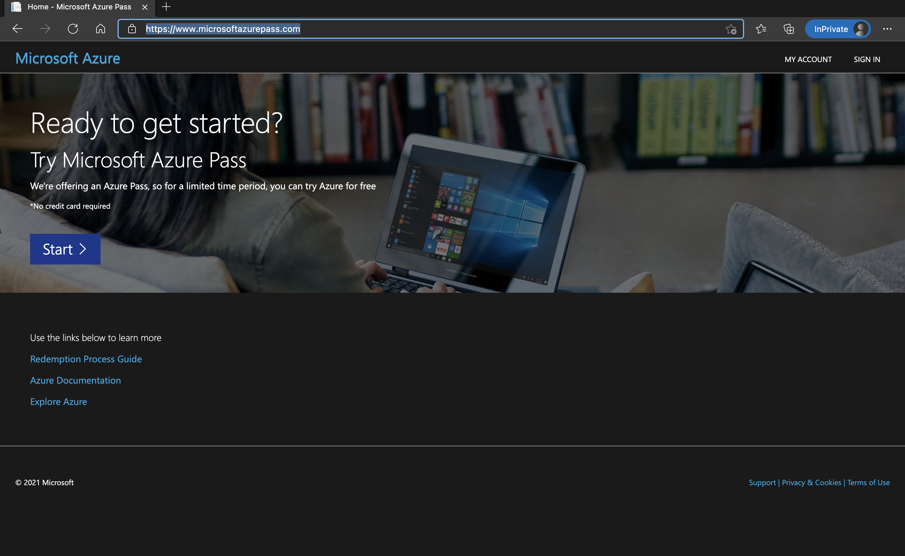
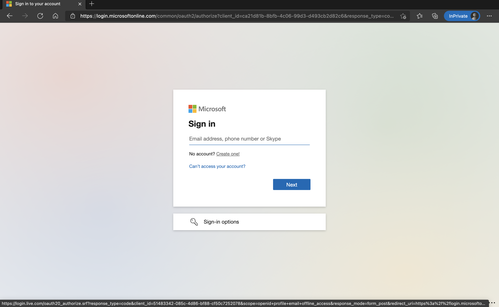
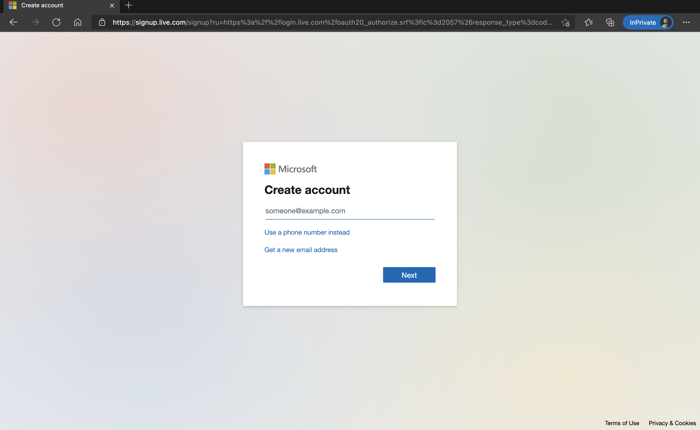
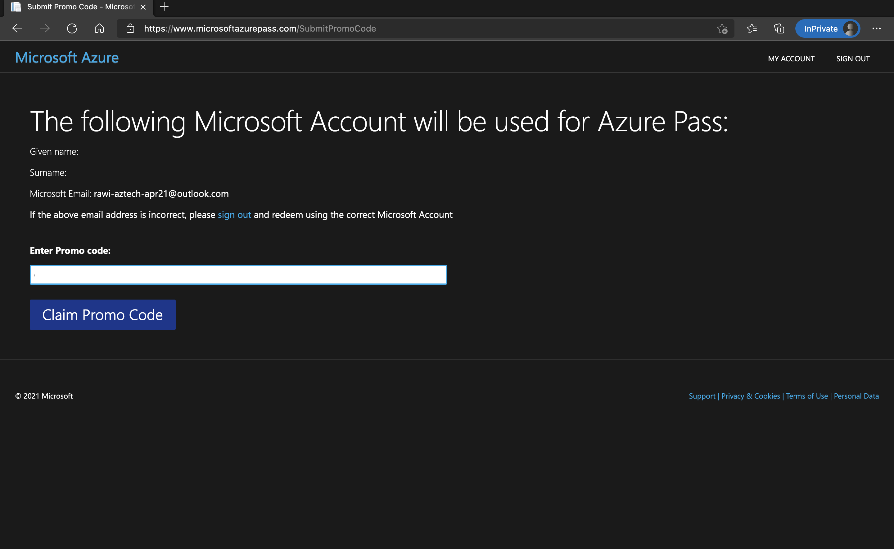

# :rocket: 01 - Set Up Your Environment for the Workshop

To ensure a smooth workshop experience, we need to set up your environment correctly. This includes creating an Azure
subscription using the provided Azure pass and preparing your code environment with the necessary tools.

## Redeem Your Azure Pass

Your Azure Pass provides a $100 USD credit for you to use with Azure, enabling you to create various resources as part
of this workshop. Follow these steps to redeem your pass:

1. Open a new private browser window. This ensures you don't accidentally link the Azure pass to an existing Microsoft
   Account or work account. Navigate to the [Microsoft Azure Pass](https://www.microsoftazurepass.com/) website and
   click the "Start" button.

   

2. Create a new Azure Account.

   
   

3. Enter the provided Promo Code.

   

Upon successful redemption, you'll have a newly setup Azure subscription.

## Prepare Your Code Environment for the Workshop

To prepare your code environment for the workshop, you need to install the following tools:

1. [JDK 17](https://docs.microsoft.com/java/openjdk/download?WT.mc_id=azurespringcloud-github-judubois#openjdk-17)
2. VSCode, or IntelliJ
3. GitHub Copilot extension for VSCode or IntelliJ. Codespaces already has GitHub Copilot extension installed. 
4. [Azure CLI version 2.64.0 or higher](https://docs.microsoft.com/cli/azure/install-azure-cli?view=azure-cli-latest).
   You can check the version of your current Azure CLI installation by running:

    ```bash
    az --version
    ```

5. [Azure Developer CLI](https://learn.microsoft.com/en-us/azure/developer/azure-developer-cli/install-azd?tabs=winget-windows%2Cbrew-mac%2Cscript-linux&pivots=os-windows)

## Log In with Azure CLI

Signing In with Azure CLI Login to Azure from the CLI with the following command, and complete the prompts to
authenticate:

```bash
az login
```

Next, install or update the necessary Azure CLI extensions for our labs

```bash
az extension add --name containerapp --upgrade --allow-preview true
az extension add --name serviceconnector-passwordless --upgrade --allow-preview true
```

Azure resource providers is to enable functionality for a specific Azure service. Some resource providers are
registered by default. For a list of resource providers registered by default, see Resource providers
for [Azure services](https://learn.microsoft.com/en-us/azure/azure-resource-manager/management/azure-services-resource-providers).

Let's register the required Azure resource providers for our labs:

```bash
az config set extension.use_dynamic_install=yes_without_prompt
az provider register --namespace Microsoft.App
az provider register --namespace Microsoft.OperationalInsights
az provider register --namespace Microsoft.ServiceLinker
```

## Prepare Your Azure Environment

This workshop provides Bicep templates to deploy the necessary resources to Azure. In case you're using your own laptop,
please git clone the project first. If you're using GitHub Codespaces, the project is already cloned for you so you
don't need to do anything.

```bash
git clone https://github.com/eggboy/aca-java-ai-workshop
cd aca-java-ai-workshop
```

Run the command `azd up` in the $HOME directory to deploy the necessary resources to Azure. This will create resources
in your Azure subscription, including:

1. Resource Group `aca-labs`
2. Log Analytics workspace
3. Azure Service Bus Namespace and Queue `keda`
4. Azure OpenAI Endpoint
5. Azure Container Apps Environment
6. Azure Database for MySQL Flexible Server

This is an example of outputs:

```bash
$ azd up
? Select an Azure location to use:  1. (Asia Pacific) East Asia (eastasia)

Packaging services (azd package)


Provisioning Azure resources (azd provision)
Provisioning Azure resources can take some time.

Subscription: ... (xxxxxxxx-xxxx-xxxx-xxxx-xxxxxxxxxxxx)
Location: East Asia

  You can view detailed progress in the Azure Portal:
  https://portal.azure.com/#view/...

  (✓) Done: Resource group: aca-labs-vyhjztie4zgue (7.168s)
  (✓) Done: Log Analytics workspace: log-vyhjztie4zgue (4.19s)
  (✓) Done: Service Bus Namespace: sb-vyhjztie4zgue (22.363s)
  (✓) Done: Azure OpenAI: cog-vyhjztie4zgue (29.06s)
  (✓) Done: Azure AI Services Model Deployment: cog-vyhjztie4zgue/gpt-4o (30.675s)
  (✓) Done: Container Apps Environment: cae-vyhjztie4zgue (1m46.019s)
  (✓) Done: Azure Database for MySQL flexible server: mysql-vyhjztie4zgue (7m14.054s)

Deploying services (azd deploy)


SUCCESS: Your up workflow to pro vision and deploy to Azure completed in 8 minutes 3 seconds.
```

`azd up` will return the name of resources created in your Azure subscription. Please go
to [Azure Portal](https://portal.azure.com) to verify the resources in the resource gorup `aca-labs`

## Configure default settings for Azure Container Apps

[!IMPORTANT] To ensure easy access to Azure Container Apps, set your default settings:

 ```bash
 az configure --defaults location={Location(eastasia or koreacentral) you selected during `azd up`} group={Resource group name created by `azd up` command. It's `aca-labs-vyhjztie4zgue` in the example above}
 ```

Also, export the name of Azure Container Apps Environment which is created by `azd up` command:

 ```bash
 export ACA_ENVIRONMENT_NAME={Azure Container Apps Environment created by `azd up` command. It's `cae-vyhjztie4zgue` in the example above}
 ```

---

:arrow_forward:
Up
Next : [02 - Create a Hello World Spring Boot App and Deploy to Azure Container Apps](../02-deploy-helloworld/README.md)