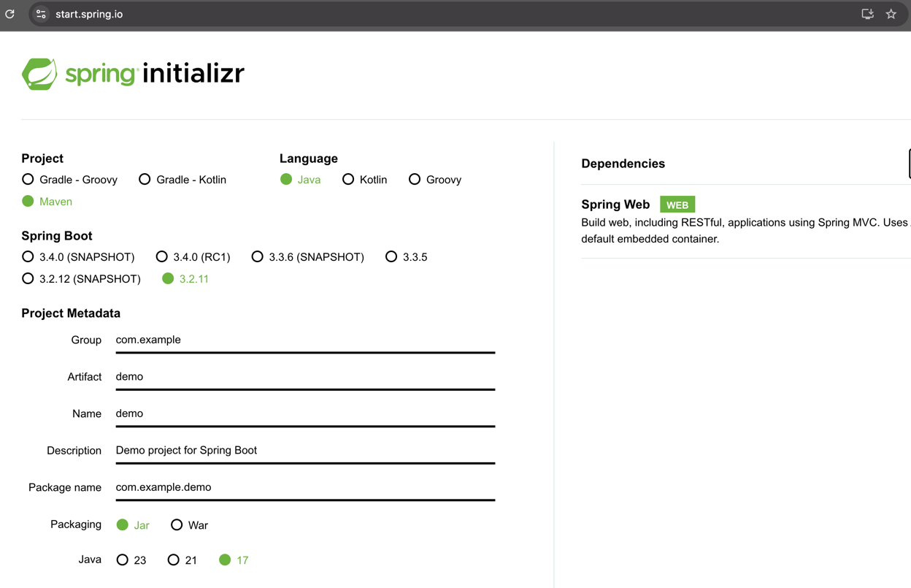
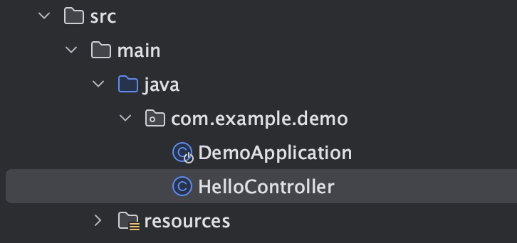
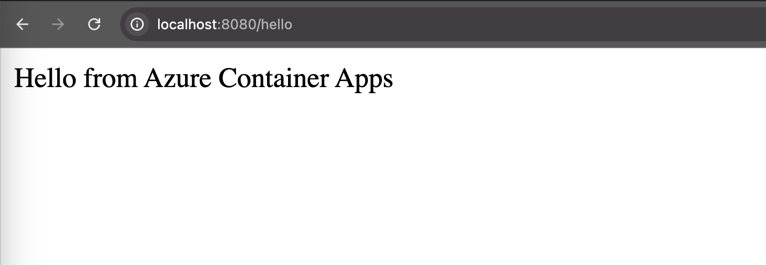
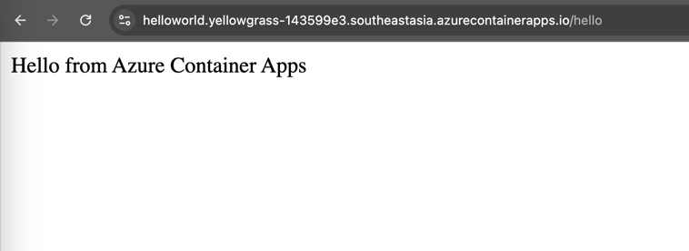
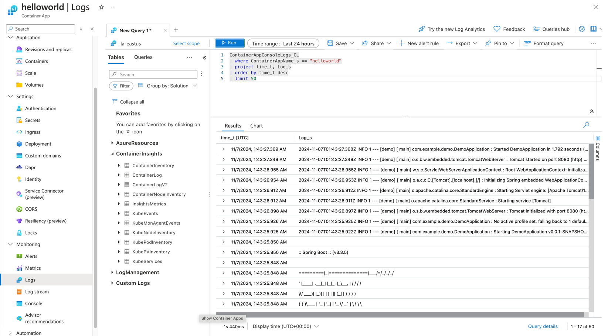
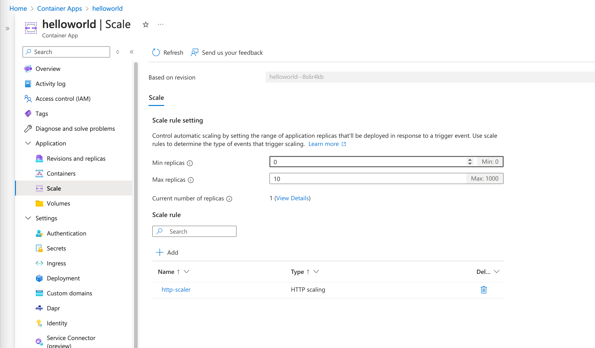

# Create a Hello World Spring Boot App and Deploy to Azure Container Apps

A typical way to create Spring Boot applications is to use the Spring Initializer at  [https://start.spring.io/](https://start.spring.io/).

>💡 __Note:__ All subsequent commands in this workshop should be run from the same directory, except where otherwise indicated via `cd` commands.



> We force the Spring Boot version to be 3.2.11, and keep default settings that use the `com.example.demo` package.

## Add a new Spring MVC Controller

In the `src/main/java/com/example/demo` directory, create a
new file  called `HelloController.java` next to `DemoApplication.java` file with
the following content:

```java
package com.example.demo;

import org.springframework.web.bind.annotation.GetMapping;
import org.springframework.web.bind.annotation.RestController;

@RestController
public class HelloController {

    @GetMapping("/hello")
    public String hello() {
        return "Hello from Azure Container Apps\n";
    }
}
```


## Test the project locally

Run the project:

```bash
./mvnw spring-boot:run
```

Requesting the `/hello` endpoint should return the "Hello from Azure Container Apps" message.



Finally, kill the running app:

The above step ensures that the hello-world app is up and running locally without any issues.

## Create and Deploy the Application on Azure Container Apps

Use the command below to create the app instance from CLI:

```bash
az containerapp up --name helloworld --environment ${ACA_ENVIRONMENT_NAME} --source . --ingress external --target-port 8080 --query properties.configuration.ingress.fqdn
```

This deploys your Spring Boot project to Azure Container Apps. Internally, Azure Container Apps uses Oryx Builder which internally makes use of Cloud Native Buildpack to build thee container image. The `--query` parameter is used to extract the fully qualified domain name (FQDN) of the app instance. This FQDN is used to access the app instance. Here is the example of the output:

```bash
Your container app helloworld has been created and deployed! Congrats!

Your app is running image caa9d8d23f12acr.azurecr.io/helloworld:cli-containerapp-20241107003317549357 and listening on port 8080
Browse to your container app at: http://helloworld.yellowgrass-143599e3.southeastasia.azurecontainerapps.io

Stream logs for your container with: az containerapp logs show -n helloworld -g sandbox-rg

See full output using: az containerapp show -n helloworld -g sandbox-rg
````

Output shows that the app is deployed successfully and The FQDN is `http://helloworld.yellowgrass-143599e3.southeastasia.azurecontainerapps.io`. You can use this URL to access the app instance.



## View Logs with Azure CLI

Go back to the terminal and run the below command to get the logs of the app instance.

```bash
az containerapp logs show -n helloworld
{"TimeStamp": "2024-11-06T16:37:39.83094", "Log": "Connecting to the container 'helloworld'..."}
{"TimeStamp": "2024-11-06T16:37:39.88611", "Log": "Successfully Connected to container: 'helloworld' [Revision: 'helloworld--84iwngl-65d4f76d4-jlbt8', Replica: 'helloworld--84iwngl']"}
{"TimeStamp": "2024-11-06T16:37:39.8864994Z", "Log": " /\\\\ / ___'_ __ _ _(_)_ __  __ _ \\ \\ \\ \\"}
{"TimeStamp": "2024-11-06T16:37:39.8866142Z", "Log": "( ( )\\___ | '_ | '_| | '_ \\/ _` | \\ \\ \\ \\"}
{"TimeStamp": "2024-11-06T16:37:39.8866782Z", "Log": " \\\\/  ___)| |_)| | | | | || (_| |  ) ) ) )"}
{"TimeStamp": "2024-11-06T16:37:39.8867333Z", "Log": "  '  |____| .__|_| |_|_| |_\\__, | / / / /"}
{"TimeStamp": "2024-11-06T16:37:39.886785Z", "Log": " =========|_|==============|___/=/_/_/_/"}
{"TimeStamp": "2024-11-06T16:37:39.8868402Z", "Log": ""}
{"TimeStamp": "2024-11-06T16:37:39.8868959Z", "Log": " :: Spring Boot ::                (v3.3.5)"}
{"TimeStamp": "2024-11-06T16:37:39.8869479Z", "Log": ""}
{"TimeStamp": "2024-11-06T16:34:24.511+00:00", "Log": "INFO 1 --- [demo] [           main] com.example.demo.DemoApplication         : Starting DemoApplication v0.0.1-SNAPSHOT using Java 17.0.10 with PID 1 (/workspace/BOOT-INF/classes started by cnb in /workspace)"}
{"TimeStamp": "2024-11-06T16:34:24.514+00:00", "Log": "INFO 1 --- [demo] [           main] com.example.demo.DemoApplication         : No active profile set, falling back to 1 default profile: \"default\""}
{"TimeStamp": "2024-11-06T16:34:25.511+00:00", "Log": "INFO 1 --- [demo] [           main] o.s.b.w.embedded.tomcat.TomcatWebServer  : Tomcat initialized with port 8080 (http)"}
```

## View Logs with Azure Portal

Streaming the console output as we just did may be helpful in understanding the immediate state of a microservice. However, sometimes it's necessary to look further into the past or to look for something specific. This is easily done with Log Analytics. 

[Open Azure Portal](https://portal.azure.com) and navigate to your container app `helloworld`. Click on "Logs". This is a shortcut to the Log Analytics workspace that was created earlier. If a tutorial appears, feel free to skip it for now.

This workspace allows you to run queries on the aggregated logs. The most common query is to get the latest log from a specific application:

__Important:__ Applications logs have a dedicated `ContainerAppConsoleLogs_CL` type.

Here is how to get its 50 most recent logs of the `ContainerAppConsoleLogs_CL` type for the microservice we just deployed:

Insert this text in the text area that states "Type your queries here or click on of the queries to start".  Click the text of the query, then click "Run".

```sql
ContainerAppConsoleLogs_CL
| where ContainerAppName_s == "helloworld"
| project time_t, Log_s
| order by time_t desc
| limit 50
```



>💡 It can also take 1-2 minutes for the console output of an Azure Container Apps microservice to be read into Log Analytics.

## Scaling Azure Container Apps

Azure Container Apps allows you to scale your containers based on your requirements. By default, ACA is set to scale from 0 to 10 replicas, and the default scaling rule uses HTTP scaling. Let's go to Azure portal and check the Scale rule settings. 



As you can see in the above image, the default scaling rule is set to scale from 0 to 10 replicas. You can also see the current  number of replicas is 1. In case you don't want auto-scaling and want to set the number of replicas to a fixed number, you can use the below command to update the instance count.

```shell
az containerapp update --name helloworld --min-replicas 1 --max-replicas 1
```


## Delete the hello-world app
Once you successfully test the hello-world app, please go ahead and delete the app to save on resources. To delete this app, use the below command.

```bash
az containerapp delete --name helloworld
```
## Conclusion

Congratulations, you have deployed your first Spring Boot app to Azure Container Apps!

---

➡️ Next guide: [03 - Hands On Lab 2 - Deploy Frontend app](../03-hol-2-deploy-frontend-app/README.md)
