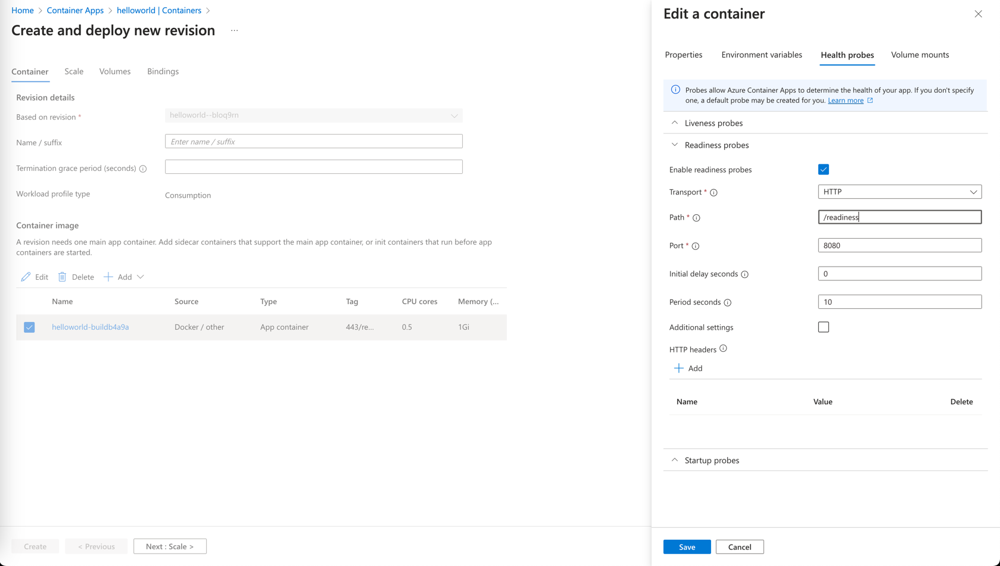
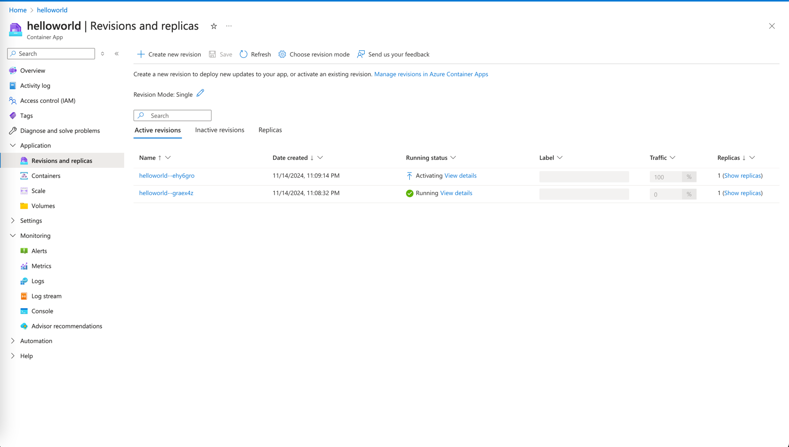
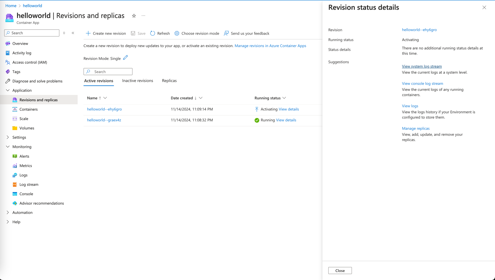
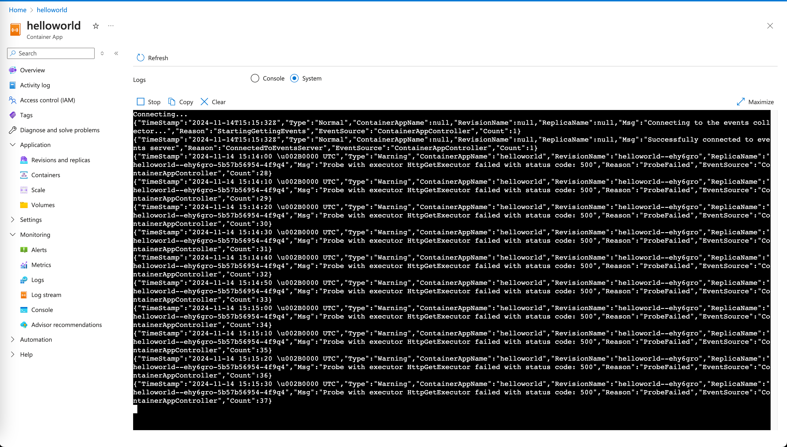

# :rocket: 02 - Create a Hello World Spring Boot App and Deploy to Azure Container Apps

# Objective

In this module, we'll focus on four key objectives:

1. :white_check_mark: Develop and Deploy a HelloWorld Spring Boot application on Azure Container Apps
2. :bar_chart: Learn to monitor the logs through Azure CLI and Azure Portal
3. :mag: Understand how to scale Azure Container Apps
4. :airplane: Familiarize with the configuration of readiness probes and revision creation

## Let's start by creating `helloworld` app

A popular method to create Spring Boot applications is to use Spring Initializer, which can be found
at  [https://start.spring.io/](https://start.spring.io/).


> If you are using Codespaces, follow these steps to create a new Spring Boot project.

```bash
mkdir helloworld
cd helloworld
curl https://start.spring.io/starter.tgz -d dependencies=web,actuator,azure-support -d bootVersion=3.3.6 -d name=helloworld -d type=maven-project | tar -xzvf -
```

> In the lab, we fix the Spring Boot version to be and keep the default settings using the `com.example.demo`
> package

In the `src/main/java/com/example/demo` directory, create a
new file named `HelloController.java` in the same package as `DemoApplication.java` file with
the following content:

```java
package com.example.demo;

import org.springframework.web.bind.annotation.GetMapping;
import org.springframework.web.bind.annotation.RestController;

@RestController
public class HelloController {

    @GetMapping("/hello")
    public String hello() {
        return "Hello from Azure Container Apps\n";
    }
}
```


## Test the project locally

Run the project:

```bash
./mvnw spring-boot:run
```

Requesting the `/hello` endpoint should return the "Hello from Azure Container Apps" message.


The above step verifies that the hello-world app is running locally without issues.

## Create and Deploy Spring Boot on Azure Container Apps

Use the command below to create the app instance from CLI:

```bash
az containerapp create --name helloworld \
  --environment ${ACA_ENVIRONMENT_NAME} \
  --source . \
  --ingress external \
  --target-port 8080 \
  --query properties.configuration.ingress.fqdn
```

This command deploys your Spring Boot project to Azure Container Apps. Internally, Azure Container Apps uses the Oryx
Builder that relies on the Cloud Native Buildpack to build the container image. The `--query` parameter extracts the
fully qualified domain name (FQDN) of the app instance, which is then used to access this instance. Here is an example
of the output:

```bash
Your container app helloworld has been created and deployed! Congrats!

Your app is running image caa9d8d23f12acr.azurecr.io/helloworld:cli-containerapp-20241107003317549357 and listening on port 8080
Browse to your container app at: http://helloworld.yellowgrass-143599e3.southeastasia.azurecontainerapps.io

Stream logs for your container with: az containerapp logs show -n helloworld -g sandbox-rg

See full output using: az containerapp show -n helloworld -g sandbox-rg
````

The output indicates that the app was successfully deployed. The FQDN is
`http://helloworld.yellowgrass-143599e3.southeastasia.azurecontainerapps.io`, which can be used to access the app
instance.


## View Logs with Azure CLI

Switch back to the terminal and run the below command to see the logs of the app instance

```bash
az containerapp logs show -n helloworld
{"TimeStamp": "2024-11-06T16:37:39.83094", "Log": "Connecting to the container 'helloworld'..."}
{"TimeStamp": "2024-11-06T16:37:39.88611", "Log": "Successfully Connected to container: 'helloworld' [Revision: 'helloworld--84iwngl-65d4f76d4-jlbt8', Replica: 'helloworld--84iwngl']"}
{"TimeStamp": "2024-11-06T16:37:39.8864994Z", "Log": " /\\\\ / ___'_ __ _ _(_)_ __  __ _ \\ \\ \\ \\"}
{"TimeStamp": "2024-11-06T16:37:39.8866142Z", "Log": "( ( )\\___ | '_ | '_| | '_ \\/ _` | \\ \\ \\ \\"}
{"TimeStamp": "2024-11-06T16:37:39.8866782Z", "Log": " \\\\/  ___)| |_)| | | | | || (_| |  ) ) ) )"}
{"TimeStamp": "2024-11-06T16:37:39.8867333Z", "Log": "  '  |____| .__|_| |_|_| |_\\__, | / / / /"}
{"TimeStamp": "2024-11-06T16:37:39.886785Z", "Log": " =========|_|==============|___/=/_/_/_/"}
{"TimeStamp": "2024-11-06T16:37:39.8868402Z", "Log": ""}
{"TimeStamp": "2024-11-06T16:37:39.8868959Z", "Log": " :: Spring Boot ::                (v3.3.5)"}
{"TimeStamp": "2024-11-06T16:37:39.8869479Z", "Log": ""}
{"TimeStamp": "2024-11-06T16:34:24.511+00:00", "Log": "INFO 1 --- [demo] [           main] com.example.demo.DemoApplication         : Starting DemoApplication v0.0.1-SNAPSHOT using Java 17.0.10 with PID 1 (/workspace/BOOT-INF/classes started by cnb in /workspace)"}
{"TimeStamp": "2024-11-06T16:34:24.514+00:00", "Log": "INFO 1 --- [demo] [           main] com.example.demo.DemoApplication         : No active profile set, falling back to 1 default profile: \"default\""}
{"TimeStamp": "2024-11-06T16:34:25.511+00:00", "Log": "INFO 1 --- [demo] [           main] o.s.b.w.embedded.tomcat.TomcatWebServer  : Tomcat initialized with port 8080 (http)"}
```

## Viewing Logs in Azure Portal

Streaming the console output, as we tried earlier, can provide a more insight understanding of a microservice's current
state.
However, sometimes it's necessary to look further into the past logs or to look for something specific in the logs. This
is easily done
with Log Analytics.

[Open Azure Portal](https://portal.azure.com) and navigate to your container app `helloworld`. Click on "Logs". This is
a shortcut to the Log Analytics workspace that was created earlier. If a tutorial appears, feel free to skip it for now.

This workspace allows you to run queries on the aggregated logs. The most common query is to get the latest log from a
specific application:

__Important:__ Applications logs have a dedicated `ContainerAppConsoleLogs_CL` type.

Here is how to get its 50 most recent logs of the `ContainerAppConsoleLogs_CL` type for the microservice we just
deployed. Paste the following query into the query editor and click "Run".

```sql
ContainerAppConsoleLogs_CL
| where ContainerAppName_s == "helloworld"
| project time_t, Log_s
| order by time_t desc
| limit 50
```


> 💡 Remember that it can take around 1-2 minutes for the console output of an Azure Container Apps microservice to be
> ingested into Log Analytics.

## Scaling Azure Container Apps

Azure Container Apps allows you to scale your containers based on your requirements. By default, ACA is set to scale
from 0 to 10 replicas, and the default scaling rule uses HTTP scaling. Let's go to the Azure portal and check the Scale
rule settings.


As shown in the image above, the default scaling rule is set to scale from 0 to 10 replicas. You can also see that the
current number of replicas is 1. In case you don't want auto-scaling and want to set the number of replicas to a fixed
number, you can use the below command to update the instance count.

```shell
az containerapp update --name helloworld --min-replicas 1 --max-replicas 1
```

## Create revision

Zero-downtime deployment is a critical feature for any application. For example on Kubernetes, we achieve this by
creating a new deployment and then updating the service to point to the new deployment. With Istio or Service Mesh in
place, we can even do canary deployments with weight based routing.

Azure Container Apps supports this feature by creating a new revision of the app, which is then updated to the new revision. By default, Azure Container Apps is set to single revision mode. In this mode, the app isn't subjected to downtime when crafting a new revision. The existing active revision isn't deactivated until the new revision is prepared. If ingress is enabled, the current revision continues to receive 100% of the traffic until the new revision is ready.

Here, we will do the small test to see how single revision mode works. **With the use of a liveness probe, we will intentionally cause the new revision to fail and see how the old revision continues to serve the traffic.**

<details markdown="block">
**<summary>Use GitHub Copilot</summary>**

Go to the previous `HelloController.java` and change the message in the `/hello` endpoint to see the difference between
the old and new revision. Then add an endpoint `/readiness` to return HTTP code 500. Prompt GitHub Copilot to return HTTP
code 500.

```java
package com.example.demo;

import org.springframework.web.bind.annotation.GetMapping;
import org.springframework.web.bind.annotation.RestController;


@RestController
public class HelloController {

    @GetMapping("/hello")
    public String hello() {
        return "Failure from Azure Container Apps\n";
    }

    // Return HTTP code 500 as return with ResponseEntity for Endpoint /readiness
}
```

> Bear in mind that GitHub Copilot may not provide the correct code.
> It is crucial for developers to understand how the prompt works and guide Copilot in the right direction. 
> For example, you could start typing `public ResponseEntity` to prompt GitHub Copilot to the right direction instead of just put the prompt and wait.


</details>

<details markdown="block">
**<summary>Write own code</summary>**

```java
package com.example.demo;

import org.springframework.http.HttpStatus;
import org.springframework.http.ResponseEntity;
import org.springframework.web.bind.annotation.GetMapping;
import org.springframework.web.bind.annotation.RestController;


@RestController
public class HelloController {

    @GetMapping("/hello")
    public String hello() {
        return "Hello from Azure Container Apps\n";
    }

    // Return HTTP code 500 as return with ResponseEntity for Endpoint /readiness
    @GetMapping("/readiness")
    public ResponseEntity<String> readiness() {
        return ResponseEntity.status(HttpStatus.INTERNAL_SERVER_ERROR).body("Not ready yet\n");
    }
}

```

</details>

Now, we will update the `helloworld` app and configure the liveness probe to `/readiness` endpoint. This will intentionally fail the new revision. Let's update the app using the command below

```shell
az containerapp up --name helloworld --environment ${ACA_ENVIRONMENT_NAME} --source . --ingress external --target-port 8080 --query properties.configuration.ingress.fqdn
```

We will change the liveness probe settings on Azure portal. Go to [Azure portal][https://portal.azure.com] and navigate
to the `helloworld` Azure
Container Apps. Click on the `Application` and then click on the `Containers`. Click on `Edit and Deploy` on the top,
and
then click on the container image.



Click on `Create` button in the bottom that will create a new revision. Now, Go to `Application` >
`Revisions and replicas`. There will be two revisions there, and one of them is shown as `Activating`.



The new revision will never be activated as we configured the readiness probe to fail intentionally. Let's check the system
logs. Click on `View details`, then click on `View system log stream`



System logs shows that probes run against newly created revision are failing.



Before we proceed with the next step, you should revert the changes made to the liveness probe by deleting the liveness probe configuration. Find the revision that is failing and click on `Edit and Deploy` and remove the liveness probe.

## :notebook_with_decorative_cover: Summary

Congratulations, you have deployed your first Spring Boot app to Azure Container Apps! Up next, we will learn how to autoscale the Azure Container Apps using KEDA.

---

:arrow_forward:
Up Next : [03 - Autoscaling with KEDA(Kubernetes-based Event Driven Autoscaler)](../03-use-keda-autoscaling/README.md)