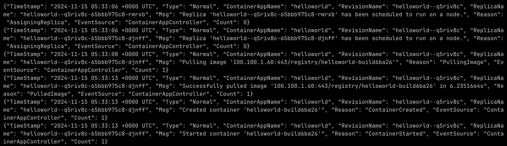
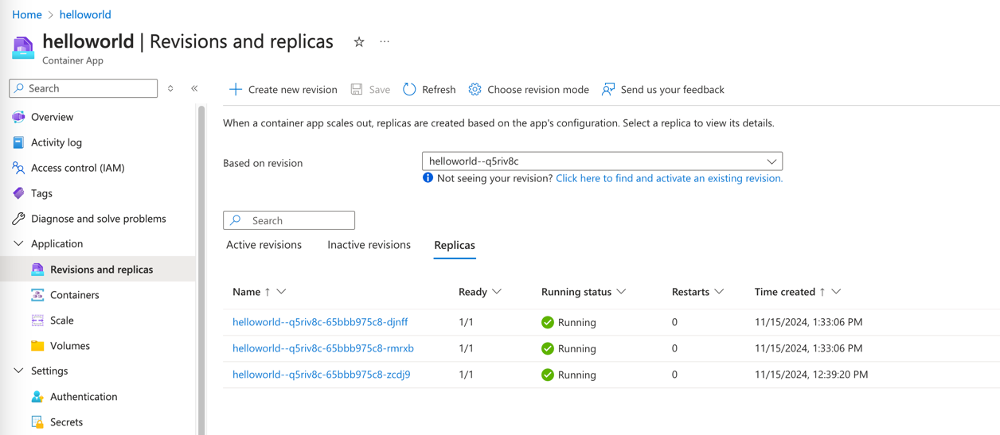
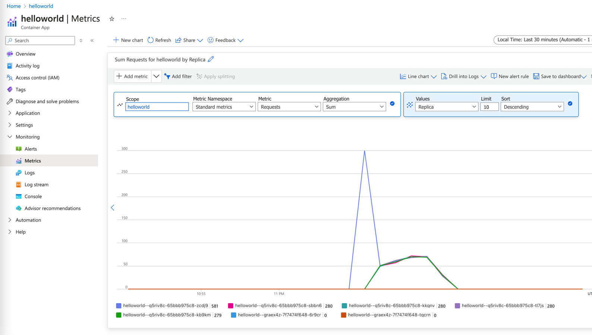
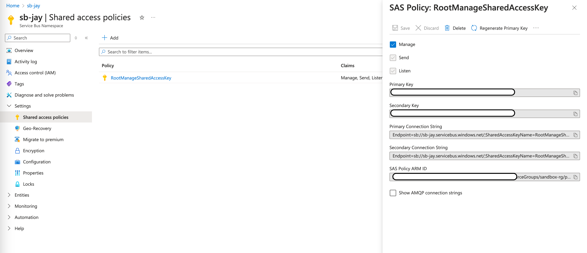
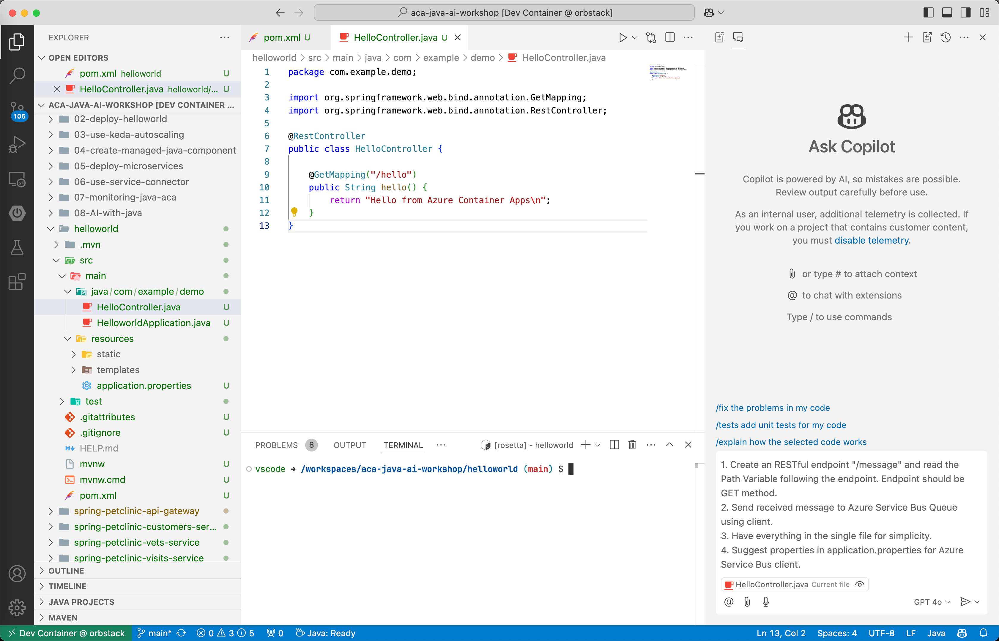
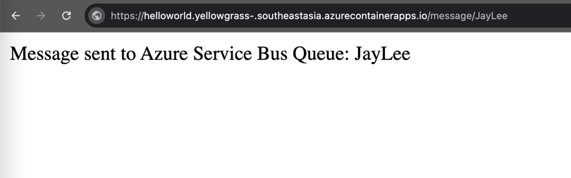
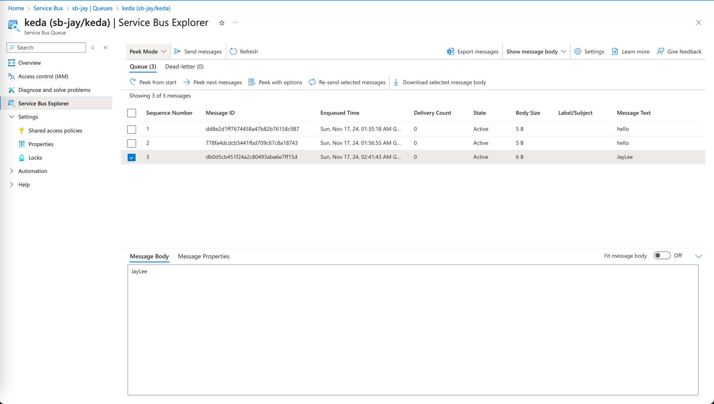
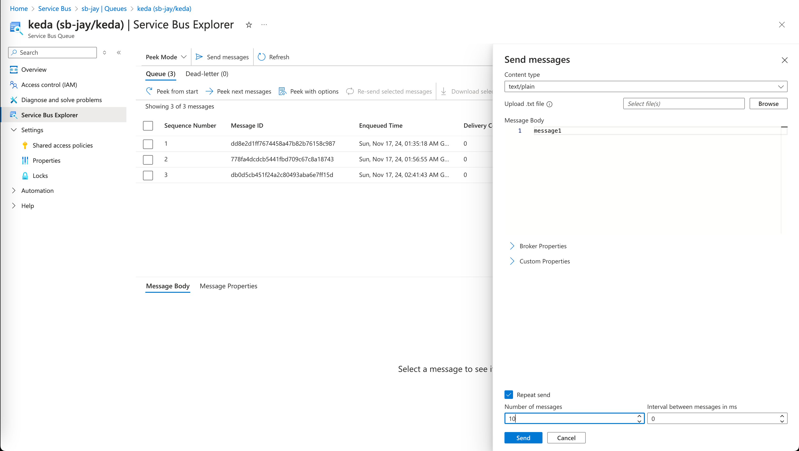

# Autoscaling with KEDA(Kubernetes-based Event Driven Autoscaler)

## Objective

In this module, we will accomplish three objectives:

1. Learn about KEDA(Kubernetes Event-Driven Autoscaler)
2. Create a different scaling rule
3. Test scaling of Azure Container Apps

https://azure.github.io/aca-dotnet-workshop/aca/09-aca-autoscale-keda/

## Auto-scaling Options on Azure Container Apps

On Azure Container Apps, there are three different categories
of [scaling triggers](https://learn.microsoft.com/en-us/azure/container-apps/scale-app?pivots=azure-cli).

1. HTTP: Based on the number of concurrent HTTP requests to your revision.
2. TCP: Based on the number of concurrent TCP connections to your revision.
3. Custom(KEDA based): Based on CPU, memory, or supported event-driven data sources such as:

- Azure Service Bus
- Azure Event Hubs
- Apache Kafka
- Redis
- and many more

Custom scaling trigger is using KEDA under the hood, and we will discuss KEDA in the following chapter. 

**Adding or editing scaling rules creates a new revision of your container app.**

## HTTP Scaling Rule

With an HTTP scaling rule, you have control over the threshold of concurrent HTTP requests that determines how your
container app revision scales. Every 15 seconds, the number of concurrent requests is calculated as the number of
requests in the past 15 seconds divided by 15. Let's set the concurrency level as 1, so we can easily simulate the
scaling with our own browser.

Update the scaling rule using Azure CLI. This can be also done on Azure Portal.

```bash
az containerapp update \
  --name helloworld \
  --min-replicas 1 \
  --max-replicas 5 \
  --scale-rule-name azure-http-rule \
  --scale-rule-type http \
  --scale-rule-http-concurrency 1
```

Open the terminal and run `az containerapp logs` to see the increase of replicas.

```bash
az containerapp logs show \
  --name helloworld \
  --type=system \
  --follow=true
```



Go to [Azure Portal](https://portal.azure.com) and check the `Revisions and replicas`. in `Replicas`, you should be able
to see multiple replicas.



In the Metrics, we can see the total requests per replica.




## What is KEDA?

**KEDA** is a Kubernetes-based Event Driven Autoscaler. With KEDA, you can drive the scaling of any container in
Kubernetes based on the number of events needing to be processed.

**KEDA** is a single-purpose and lightweight component that can be added into any Kubernetes cluster. KEDA works
alongside standard Kubernetes components like the Horizontal Pod Autoscaler and can extend functionality without
overwriting or
duplication. With KEDA you can explicitly map the apps you want to use event-driven scale, with other apps continuing to
function. This makes KEDA a flexible and safe option to run alongside any number of any other Kubernetes applications or
frameworks.

## Azure Service Bus Scaling Rule

We're going to test Custom scaling rule with Azure Service Bus. First thing to do is to find the connection string and queue name of the Azure Service Bus. Azure Service Bus and queue were created in the previous module. Queue name is `keda` and connection string can be found in the Azure Portal.



Now, choose the scenario you want to follow. You can either use GitHub Copilot to create the Azure Service Bus publisher or manually publish messages into the Azure Service Bus Queue. If you choose the first scenario, feel free to go through the second scenario as well. If you choose the second scenario, still go through the first scenario to see how GitHub Copilot can help you in your development process.

<details markdown="block">
**<summary>Scenario 1 - Use GitHub Copilot to create Azure Service Bus publisher</summary>**

First step is to add Azure Service Bus dependency to your `pom.xml` file. Open the `pom.xml` file and add the following:

```xml
		<dependency>
			<groupId>com.azure</groupId>
			<artifactId>azure-messaging-servicebus</artifactId>
			<version>7.17.6</version>
		</dependency>

```

We will generate the code using GitHub Copilot Chat with small prompt engineering. Look at the following screen capture. 



There are two things to note: 
1. Two tabs are opened, `pom.xml` and `HelloController.java`.
2. Actual prompt in the GitHub Copilot Chat is as below. 
```plaintext
1. Create an RESTful endpoint "/message" and read the Path Variable following the endpoint. Endpoint should be GET method.
2. Send received message to Azure Service Bus Queue using client.
3. Have everything in the single file for simplicity.
4. Suggest properties in application.properties for Azure Service Bus client.
```

Generated code would look like below. **NOTE**: GitHub Copilot synthesizes the code based on the prompt everytime, so your code may look different. 

```java
package com.example.demo;

import com.azure.messaging.servicebus.ServiceBusClientBuilder;
import com.azure.messaging.servicebus.ServiceBusSenderClient;
import org.springframework.beans.factory.annotation.Value;
import org.springframework.web.bind.annotation.GetMapping;
import org.springframework.web.bind.annotation.PathVariable;
import org.springframework.web.bind.annotation.RestController;

@RestController
public class HelloController {

    @Value("${azure.servicebus.connection-string}")
    private String connectionString;

    @Value("${azure.servicebus.queue-name}")
    private String queueName;

    @GetMapping("/hello")
    public String hello() {
        return "Hello from Azure Container Apps\n";
    }

    @GetMapping("/message/{msg}")
    public String sendMessage(@PathVariable String msg) {
        ServiceBusSenderClient senderClient = new ServiceBusClientBuilder()
            .connectionString(connectionString)
            .sender()
            .queueName(queueName)
            .buildClient();

        senderClient.sendMessage(new com.azure.messaging.servicebus.ServiceBusMessage(msg));
        senderClient.close();

        return "Message sent to Azure Service Bus Queue: " + msg;
    }
}
```

GitHub Copilot also suggests to add the following properties to `application.properties` file. Use the values that we make a note in the previous step.

```properties
azure.servicebus.connection-string=YOUR_SERVICE_BUS_CONNECTION_STRING
azure.servicebus.queue-name=YOUR_QUEUE_NAME
```

Now, run the application and test the new REST endpoint as below. If invoked correctly, you should see the message similar to below.



Check the actual message enqueued in the Azure Service Bus Queue. You can see the enqueued message in the Azure Portal. Go to the Azure Portal, find the Service Bus Queue, and click on the `Service Bus Explorer`. It provides a `Peek Mode` to see the messages in the queue. Click on the `Peek from start` to see all the messages in the queue.


</details>

<details markdown="block">
**<summary>Scenario 2 - Manually Publish Messages into Azure Service Bus Queue</summary>**

On Azure Portal, go to the Service Bus Queue and click on the `Service Bus Explorer`. There is `Send Messages` button on the top to send messages to the queue. `Repeat Send` button can be used to send multiple messages at once.



</details>

We're ready to publish messages into the Azure Service Bus Queue. KEDA needs a connection string to connect to the Azure Service Bus. Ideally, we should use managed identity minimize the security risk. However, for the simplicity, we will use the connection string. We will discuss about managed identity in detail in the following modules.

Create a secret in the Azure Container Apps to store the connection string. Put the correct connection string in the following command. 

```bash
az containerapp secret set \
        --name helloworld \
        --secrets service-bus-connection-string="Endpoint=..."
````

We're going to restart the container app to apply the new secret. Find the active revision first. 

```bash
az containerapp revision list -n helloworld -o table
````

Then restart the active revision. For example,

```bash
az containerapp revision restart -n helloworld --revision helloworld--50kr6mp
```

Once the container app is restarted, we can create a scaling rule using Azure CLI.

```bash
az containerapp update \
  --name helloworld \
  --min-replicas 0 \
  --max-replicas 5 \
  --scale-rule-name azure-servicebus-queue-rule \
  --scale-rule-type azure-servicebus \
  --scale-rule-metadata "queueName=keda" \
                        "namespace=service-bus-namespace" \
                        "messageCount=1" \
  --scale-rule-auth "connection=service-bus-connection-string"
```

Scaling rule is created. Now, try to publish messages into the Azure Service Bus Queue. You should see the scaling of the container app. Also, delete the messages in the queue to see the decrease of the replicas.

```bash
az containerapp revision list -n helloworld -o table
CreatedTime                Active    Replicas    TrafficWeight    HealthState    ProvisioningState    Name
-------------------------  --------  ----------  ---------------  -------------  -------------------  -------------------
2024-11-17T01:06:02+00:00  True      4           100              Healthy        Provisioned          helloworld--az242pu
```


> 💡 __Note:__ If scaling is not working as expected, you can check the logs to see the reason. Go to Azure Portal and check the logs in `Logs` section.
> ```kusto
> ContainerAppSystemLogs_CL
> | where Reason_s == "KEDAScalerFailed"
>| project TimeGenerated, ContainerAppName_s, ReplicaName_s, Log_s, Reason_s
>```


---

➡️
Next : [02 - Create a Hello World Spring Boot App and Deploy to Azure Container Apps](../02-deploy-helloworld/README.md)
