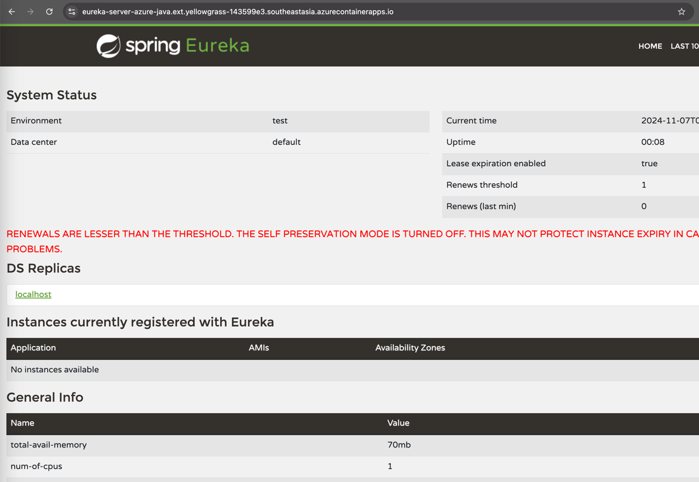
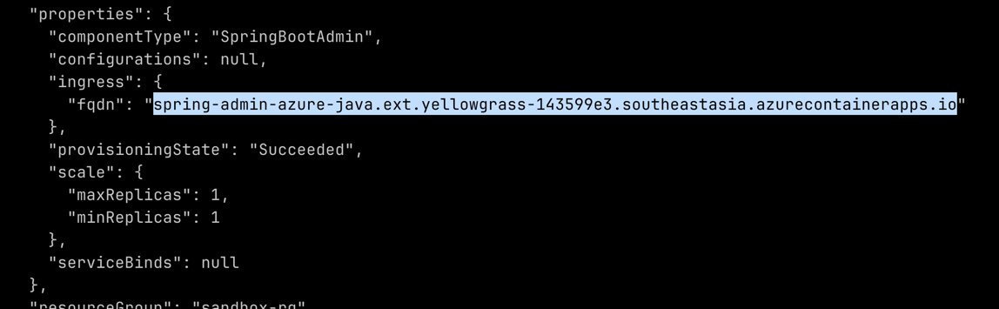
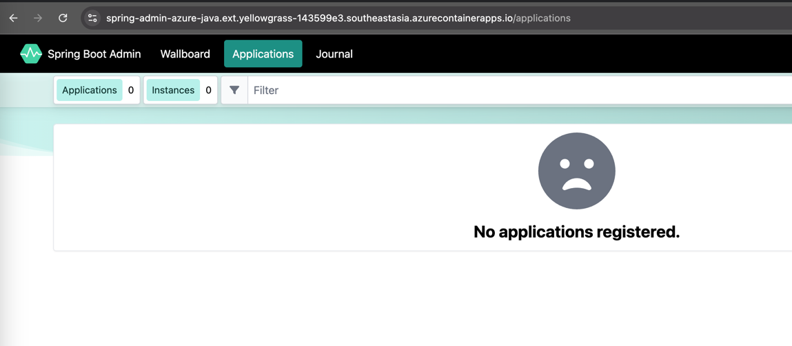

# :rocket: Create Managed Java Component on Azure Container Apps

Azure Container Apps provides several managed component which could help customers running Spring Boot in production. These include Eureka Server, Config Server, and Spring Boot Admin.

## Objective

In this module, we'll focus on three key objectives:

1. :white_check_mark: Create various managed components for Spring Boot applications.
2. :bar_chart: Access the Eureka Server dashboard.
3. :mag:  Access the Spring Boot Admin dashboard.

---

## Create Managed Eureka Server

One of the fundamental requirement of a cloud-native application is *service discovery* - the ability to find and identify the different microservices. In this section, we'll create a [Spring Cloud Eureka Server](https://spring.io/projects/spring-cloud-netflix) to enable this functionality.

1. Set the environment variables to define the Eureka Server name.

```bash
EUREKA_SERVER_NAME="eurekaserver"
```

2. Create the Managed Eureka Server.

```bash
az containerapp env java-component eureka-server-for-spring create \
  --environment ${ACA_ENVIRONMENT_NAME} \
  --name ${EUREKA_SERVER_NAME} \
  --query properties.ingress.fqdn -o tsv
```

3. Access Eureka Dashboard using the FQDN returned by above command.


## Create Managed Config Server

Another fundamental requirement of cloud-native applications is *externalized configuration*- the ability to store, manage, and version configuration separately from the application code. In this section, we'll create and configure a [Spring Cloud Config Server](https://spring.io/projects/spring-cloud-config) to enable this functionality. In the next section, you'll see how Spring Cloud Config can inject configuration from a Git repository into your application.

To use this shortcut:

1. Set the following environment variables to define the Config Server name and the Git repository URL to be used as the configuration source.
   ```bash
   CONFIG_SERVER_NAME="configserver"
   GIT_URL="https://github.com/eggboy/spring-petclinic-microservices-config"
   ```
2. Create the Managed Config Server for Spring and set its configuration source as the public Git repository.
   ```bash
   az containerapp env java-component config-server-for-spring create \
   --environment ${ACA_ENVIRONMENT_NAME} \
   --name ${CONFIG_SERVER_NAME} \
   --configuration spring.cloud.config.server.git.uri=$GIT_URL spring.cloud.config.server.git.refresh-rate=60
   ```

## Creating Managed Spring Boot Admin

The Admin for Spring managed component offers an administrative interface for Spring Boot web applications that expose actuator endpoints. As a managed component in Azure Container Apps, you can easily bind your container app to Admin for Spring for seamless integration and management.

1. Set the following environment variables to define the Spring Boot Admin name.
   ```bash
   SPRING_ADMIN_NAME="admin"
   ```
2. Create the Managed Spring Boot Admin.

```bash
az containerapp env java-component admin-for-spring create \
--environment ${ACA_ENVIRONMENT_NAME}  \
--name ${SPRING_ADMIN_NAME} \
  --min-replicas 1 \
  --max-replicas 1 \
--query properties.ingress.fqdn -o tsv
```
3. Access Spring Boot Admin console using FQDN returned from the command above. Spring Boot Admin is by default secured by Azure Entra ID.




## :notebook_with_decorative_cover: Summary

In this module, we created a managed Eureka Server, Config Server, and Spring Boot Admin. Furthermore, We explored the Eureka Server dashboard and Spring Boot Admin dashboard. Up next, we will deploy the PetClinic microservices.

---

:arrow_forward::️ Up Next : [05 - Deploy PetClinic Microservices](../05-deploy-microservices/README.md)