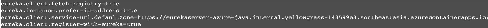

# Create Backend Microservices

## Deploy backend Services

We're going to deploy 3 microservices on Azure Container Apps, customers-service, visits-service, and vets-service. This
time, we will deploy each services with artifact and bind them to Eureka Server and Config Server. You can bind/unbind
Java components during deployment, or after deployment. Here, we will bind it after deployment for the example.

### Deploy customers-service

First, build the project using maven and deploy it with `az containerapp create` command.

```bash
cd spring-petclinic-customers-service
mvn clean package
az containerapp create \
  --name customers-service \
  --environment ${ACA_ENVIRONMENT_NAME} \
  --artifact target/customers-service-3.2.11.jar \
  --ingress external \
  --target-port 8080 \
  --query properties.configuration.ingress.fqdn \
  --min-replicas 1
```

Bind the Eureka Server and Config Server to the customers-service.

```bash
az containerapp update \
    --name customers-service \
    --bind eurekaserver configserver
```

### Deploy visits-service

First, build the project using maven and deploy it with `az containerapp create` command.

    ```bash
    cd spring-petclinic-visits-service
    mvn clean package
    az containerapp create \
      --name visits-service \
      --environment ${ACA_ENVIRONMENT_NAME} \
      --artifact target/visits-service-3.2.11.jar \
      --ingress external \
      --target-port 8080 \
      --query properties.configuration.ingress.fqdn \
      --min-replicas 1 \
      --bind eurekaserver configserver
    ```

Bind the Eureka Server and Config Server to the customers-service.

    ```bash
    az containerapp update \
        --name visits-service \
        --bind eurekaserver configserver
    ```

### Deploy vets-service

Build the project using maven and deploy it with `az containerapp create` command.

    ```bash
    cd spring-petclinic-vets-service
    mvn clean package
    az containerapp create \
      --name vets-service \
      --environment ${ACA_ENVIRONMENT_NAME} \
      --artifact target/vets-service-3.2.11.jar \
      --ingress external \
      --target-port 8080 \
      --query properties.configuration.ingress.fqdn \
      --min-replicas 1 \
      --bind eurekaserver configserver
    ```

## Java Components Binding

We bind the Java components to the Eureka Server and Config Server to each Container Apps. Binding Java components to Container apps is to connect the Java components to the Container Apps, and this allows Container Apps to make use of the Java components.

By binding Eureka Server, environment variables are set, so that Eureka Discovery Client can discover the Eureka Server. 



By binding Config Server, environment variables are set, so that Spring Cloud Config can discover the Config Server. 


## Azure Service Connector


## Azure Service Connector

