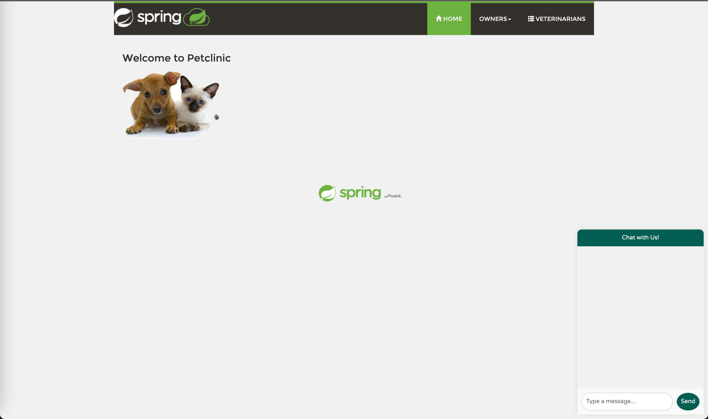
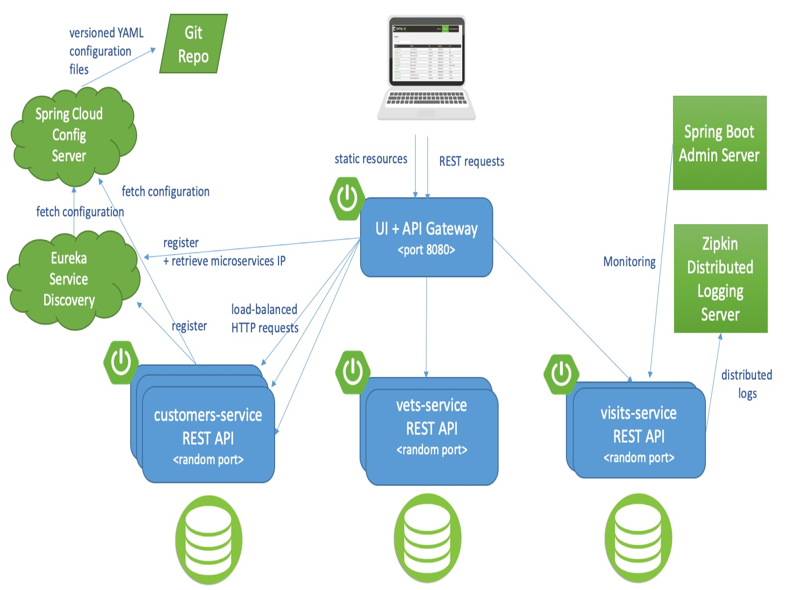
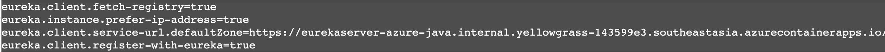
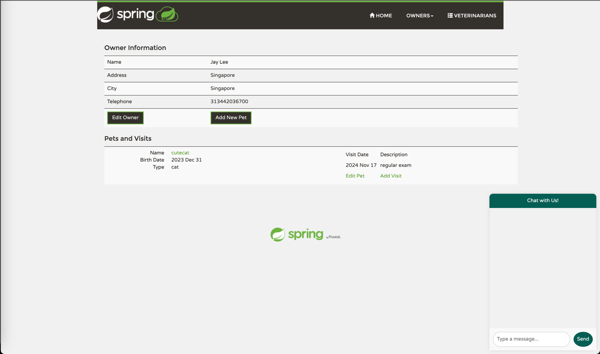

# :rocket: Deploy PetClinic Microservices



In this lab, we will be deploying the backend microservices of the Spring PetClinic application: the
`customers-service`, `visits-service`, and `vets-service`. These services are all built using Spring Boot. The frontend
microservice is `api-gateway` which is built using Angular and Spring Cloud Gateway.



By default, the Spring PetClinic application uses an in-memory database, but we will change it to use Azure Database for
MySQL
Flexible Server in chapter 06. Each service will also be bound to the Eureka Server, so the UI+API Gateway can discover
the services through Eureka Server. Also, we will bind all the microservices to the Config Server to get the
configuration from the Config Server.

## Objective

In this module, we'll focus on two key objectives:

1. :white_check_mark: Deploy the Spring PetClinic backend services to Azure Container Apps.
2. :bar_chart: Bind all the services to Eureka Server and Config Server.

---

## Deploying Backend Services

As our first step, we're going to deploy 3 microservices on Azure Container Apps, `customers-service`, `visits-service`,
and `vets-service`. This
time, we will deploy each services with artifact and bind them to Eureka Server and Config Server. You can bind/unbind
Java components during deployment, or after deployment. Here, we will bind it after deployment for the example.

### Deploying `customers-service`

First, build the project using maven and deploy it with `az containerapp create` command. For this app, we separate the
depoyment and binding steps to show how to bind Java components to the Container Apps after deployment.

```bash
cd ~/spring-petclinic-customers-service
mvn clean package
az containerapp create \
  --name customers-service \
  --environment ${ACA_ENVIRONMENT_NAME} \
  --artifact target/customers-service-3.2.11.jar \
  --ingress external \
  --target-port 8080 \
  --query properties.configuration.ingress.fqdn \
  --min-replicas 1
```

Bind the Eureka Server, Config Server and Spring Boot Admin to the customers-service.

```bash
az containerapp update \
    --name customers-service \
    --bind eurekaserver configserver springadmin
```

### Deploying `visits-service`

This time, we will deploy the `visits-service` with the artifact and bind it to all the managed Java components.

```bash
cd ~/spring-petclinic-visits-service
mvn clean package
az containerapp create \
  --name visits-service \
  --environment ${ACA_ENVIRONMENT_NAME} \
  --artifact target/visits-service-3.2.11.jar \
  --ingress external \
  --target-port 8080 \
  --query properties.configuration.ingress.fqdn \
  --min-replicas 1 \
  --bind eurekaserver configserver admin
```

### Deploying `vets-service`

Repeat the same steps as above to deploy the `vets-service`.

    ```bash
    cd ~/spring-petclinic-vets-service
    mvn clean package
    az containerapp create \
      --name vets-service \
      --environment ${ACA_ENVIRONMENT_NAME} \
      --artifact target/vets-service-3.2.11.jar \
      --ingress external \
      --target-port 8080 \
      --query properties.configuration.ingress.fqdn \
      --min-replicas 1 \
      --bind eurekaserver configserver admin
    ```

## Deploying Frontend Service

Build the project using maven and deploy it with `az containerapp create` command.

    ```bash
    cd spring-petclinic-api-gateway
    mvn clean package
    az containerapp create \
      --name frontend-service \
      --environment ${ACA_ENVIRONMENT_NAME} \
      --artifact target/api-gateway-3.2.11.jar \
      --ingress external \
      --target-port 8080 \
      --query properties.configuration.ingress.fqdn \
      --min-replicas 1 \
      --bind eurekaserver configserver admin
    ```

## Exploring Java Components Binding

When we bound the Java components to the Eureka Server and Config Server, we connected the Java components to the
Container Apps. This essentially injects various environment variables into the Container Apps.

For example, the Eureka Server binding sets the environment variables as seen below:



Similarly, the Config Server binding sets the following environment variables:


## Testing PetClinic Application

Now that we have deployed the backend services and the frontend service, we can test the application. Open the browser and navigate to the frontend service URL.

1. Click on `Owners` to see the list of owners.
2. Click on `Veterinarians' to see the list of veterinarians.
3. Back to  `Owners` and register a new owner.
4. Navigate to a new owner and add a new pet.



## :notebook_with_decorative_cover: Summary

In this chapter, we deployed the Spring PetClinic backend services to Azure Container Apps. We also deployed the
frontend
service. We bound the backend services to Eureka Server and Config Server. We explored the Java components binding to
the Container Apps. Up Next, we will use Azure Service Connector to connect the backend services to Azure Database for
MySQL flexible server.

---

:arrow_forward::️ Up Next : [06 - Use Azure Service Connector](../06-use-service-connector/README.md)
