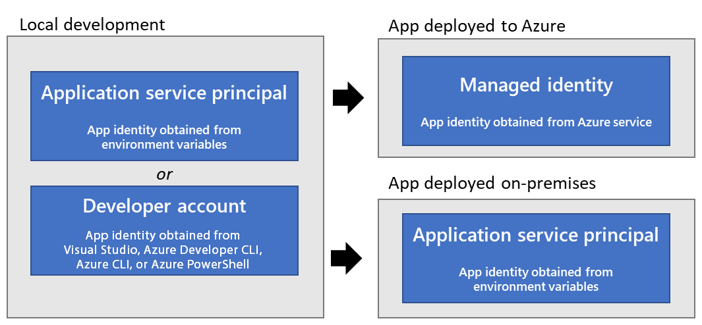

# :rocket: Use Azure Service Connector

Azure Service Connector helps you connect your application to other backing services. Service Connector configures the
network settings and connection information (for example, generating environment variables) between application services
and target backing services in management plane. Developers use their preferred SDK or library that consumes the
connection information to do data plane operations against the target backing service.

In this lab, you will learn how to use Azure Service Connector to connect your Java application
to Azure Database for MySQL Flexible Server without exposing the connection string in the code. But Before we start, let's first familiarize with the fundamentals of the authentication mechanism within Azure SDK.

## Objective

In this module, we'll focus on four key objectives:

1. :white_check_mark: Understand the basics of application authentication for Azure resources with Azure SDK.
2. :bar_chart: Understand the Managed Identity and its benefits over Service Principal.
3. :mag: Configure the backend services to use managed identity to connect to MySQL database.
4. :airplane: Understand the concept of passwordless connection with Service Connector.

---

## :book: Basics - Application Authentication for Azure resources

When an app needs to access an Azure resource, the app must be authenticated to Azure. This is true for all apps,
whether deployed to Azure, deployed on-premises, or under development on a local developer workstation.



There are 3 approaches to authenticate an application to Azure:

1. Developer account - Identity obtained from VSCode, IntelliJ, Azure CLI or PowerShell
2. Service Principal - Identity obtained from Azure Entra ID
3. Managed Identity - Identity obtained from Azure Managed Identity

Choosing between a service principal and managed identity depends on the specific scenario. However, the typical preference is to start with managed identity in all possible scenarios before falling back onto the service principal when managed identity isn't supported. Good example of it is, Apps hosted outside of Azure (for example on-premises apps) that need to connect to
Azure services.

## :book: Basics - Why Azure Managed Identity?

Service Principal traditionally has been a common way to authenticate an application to Azure resources, but it has major caveat: it's just a combination of an ID and secret. While storing secrets securely in the Azure Key Vault is possible, accessing the Azure Key Vault through a service principal poses a security risk.

Managed Identifies alleviate this problem by providing an automatically-managed identity within Microsoft Entra ID. This capability allows applications to use managed identities to obtain Microsoft Entra tokens without having to manually manage any credentials.

There are two types of managed identities:

- System-assigned. Some Azure resources, such as virtual machines allow you to enable a managed identity directly on the
  resource. When you enable a system-assigned managed identity:
    - A service principal of a special type is created in Microsoft Entra ID for the identity. The service principal is
      tied to the lifecycle of that Azure resource. When the Azure resource is deleted, Azure automatically deletes the
      service principal for you.
    - By design, only that Azure resource can use this identity to request tokens from Microsoft Entra ID.
    - You authorize the managed identity to have access to one or more services.
- User-assigned. You may also create a managed identity as a standalone Azure resource. You can create a user-assigned
  managed identity and assign it to one or more Azure Resources. When you enable a user-assigned managed identity:
    - A service principal of a special type is created in Microsoft Entra ID for the identity. The service principal is
      managed separately from the resources that use it.
    - User-assigned identities can be used by multiple resources.
    - You authorize the managed identity to have access to one or more services.

## :book: Basics - Spring Cloud Azure(Azure SDK for Spring Boot)

Spring Cloud Azure is an open-source project that provides seamless Spring integration with Azure. When it comes to
authentication, Spring Cloud Azure uses `DefaultAzureCredential` which is intended to provide the simplified
authentication mechanism for development and production environments. It is a chain of credentials that is tried in order
automatically, and the first available credential is used to authenticate. This approach enables your app to use
different authentication methods in different environments (local dev vs. production) without implementing
environment-specific code.


To configure managed identity with Spring Cloud Azure, the following properties must be set in your `application.properties`
file:

```properties
spring.cloud.azure.credential.managed-identity-enabled=true
spring.cloud.azure.credential.client-id=<Client ID of Managed Identity>
```

## :book: Basics - Passwordless Connection with Service Connector

Passwordless connections use managed identities to access Azure services. With this approach, you don't have to manually
track and manage secrets for managed identities. These tasks are securely handled internally by Azure.

Service Connector enables managed identities in app hosting services like Azure Spring Apps, Azure App Service, and
Azure Container Apps. Service Connector also configures database services, such as Azure Database for PostgreSQL, Azure
Database for MySQL, and Azure SQL Database, to accept managed identities.

### Create Service Connector

Previously deployed backend services are using in-memory database. In this chapter, we will create Service Connector to
connect the backend services to Azure Database for MySQL Flexible Server as the database.

Let's create a Managed Identity for the MySQL database using Azure CLI.

```bash
az identity create --name aca-mysql-mi
```

Next, we start creating Service Connector from [Azure Portal](https://portal.azure.com/). We will start with
vets-service.
Create a Connection following the screen below.


Choose the Managed Identity created in the previous step.


On `Revew + Create` page, it shows the command to create the Service Connector which would look like below.

```bash
az containerapp connection create mysql-flexible \
--connection mysql_a4696 \
--source-id /subscriptions/../resourceGroups/.../providers/Microsoft.App/containerApps/vets-service \
--target-id /subscriptions/.../resourceGroups/.../providers/Microsoft.DBforMySQL/flexibleServers/jay-aca-java-labs/databases/aca-labs \
--client-type springBoot \
--user-identity client-id=28237d6c.. subs-id=6535fca9.. mysql-identity-id=/subscriptions/.../resourcegroups/.../providers/Microsoft.ManagedIdentity/userAssignedIdentities/aca-mysql-mi 
-c vets-service-build42982
```

After running the command, the Service Connector will configure MySQL with a password-free connection, opens the firewall rule, and injects several environment variables for the `springBoot` service type specified in the CLI command above. Service Connector injects different environment variable depending on the given service type and the target service. Look at the [Azure Service Bus](https://learn.microsoft.com/en-us/azure/service-connector/how-to-integrate-service-bus?tabs=dotnet) as an example. 

Return to the Azure Portal to check your newly created Service Connector.

Do note the injected the environment variable `spring.datasource.azure.passwordless-enabled=true`. It enables Spring
Cloud Azure to use the managed identity to connect to the MySQL database.


Finally, specify the SPRING_ACTIVE_PROFILE to `passwordless` in the vets-service:

```bash
az containerapp update --name vets-service --set-env-vars SPRING_PROFILES_ACTIVE=passwordless
```

> 💡 [!NOTE]
> `passwordless` profile will automatically create tables on MySQL. Use client tools like MySQL Workbench to see the
> tables.

> [!IMPORTANT]
> **Repeat the same steps for customers-service and visits-service**


## :notebook_with_decorative_cover: Summary

---

➡️
:arrow_forward::️ Up
Next : [07 - Monitoring Java Applications on Azure Container Apps](../07-monitoring-java-aca/README.md)