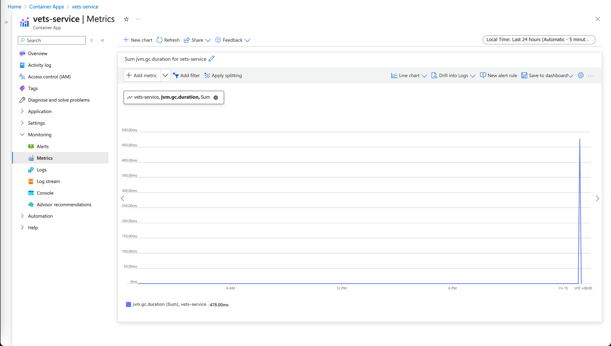
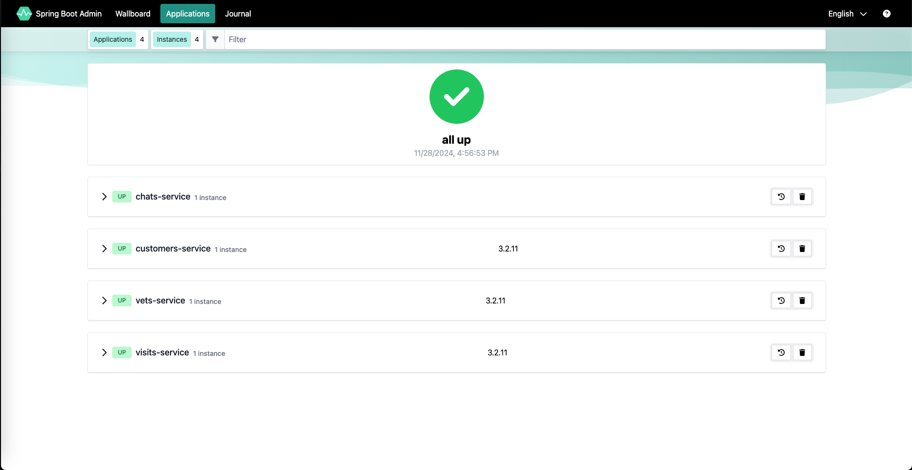
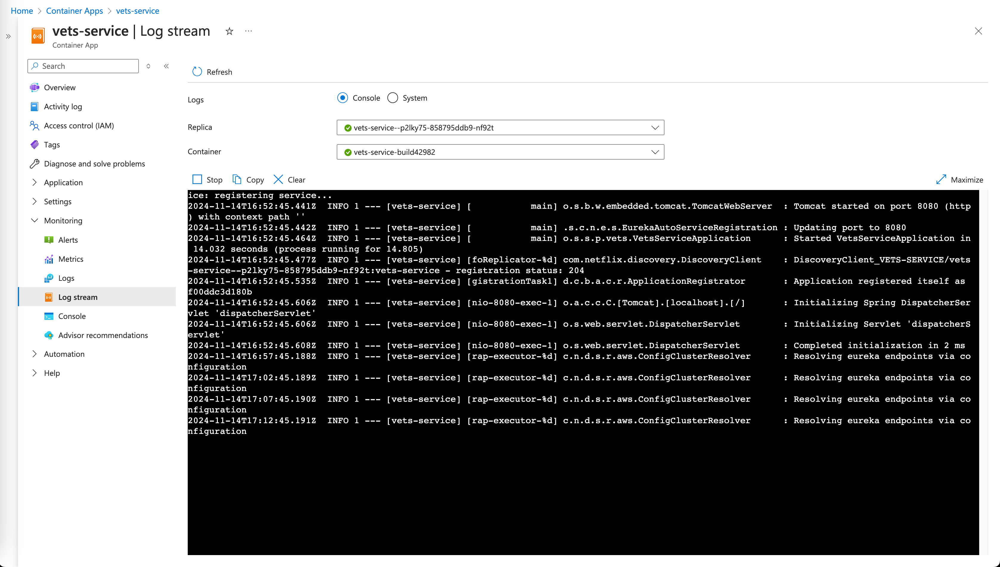

# :rocket: Monitoring Java Applications on Azure Container Apps

Monitoring is a critical part of running applications in production. Azure Container Apps provides several monitoring options to help you monitor your Java applications.

---

## Objective

In this module, we'll focus on three key objectives:
1. :white_check_mark: Enable Java Metrics for the backend services.
2. :bar_chart: Access the Spring Boot Admin dashboard.
3. :airplane: Monitor the logs using Log Analytics.

## Enabling Java Metrics

Java Virtual Machine (JVM) metrics are critical for monitoring the health and performance of your Java applications. The
data collected includes insights into memory usage, garbage collection, thread count of your JVM.

Let's update the backend services to enable Java metrics.

```bash
az containerapp update \
  --name vets-service \
  --enable-java-metrics=true
  
az containerapp update \
  --name customers-service \
  --enable-java-metrics=true

az containerapp update \
  --name visits-service \
  --enable-java-metrics=true
  
```

Once metrics are enabled, you can view the metrics in the Azure Portal. Go to Azure Portal and navigate to `Metrics`.



List of collected metrics can be
found [here](https://learn.microsoft.com/en-us/azure/container-apps/java-metrics?tabs=create&pivots=azure-cli#collected-metrics)

## Spring Boot Admin

The Admin for Spring managed component offers an administrative interface for Spring Boot web applications that expose
actuator endpoints.

Let's find the Spring Boot Admin URL using Azure CLI.

```bash
az containerapp env java-component admin-for-spring show \
  --environment ${ACA_ENVIRONMENT_NAME} \
  --name admin --query properties.ingress.fqdn
```

Open the browser and navigate to the Spring Boot Admin URL.



> [!IMPORTANT]
> **Navigate the menus and get familiar with Spring Boot Admin**

## Log Streaming

You can view system logs and console logs in the Azure portal. System logs are generated by the container app's runtime. Console logs are generated by your container app.

Go to your container app in the Azure portal. Select Log stream under the Monitoring section on the sidebar menu. To view the console log stream, select Console. If you have multiple revisions, replicas, or containers, you can select from the drop-down menus to choose a container. If your app has only one container, you can skip this step.



## Monitoring Logs with Log Analytics

Azure Container Apps is integrated with Azure Monitor Log Analytics to monitor and analyze your container app's logs.
When selected as your log monitoring solution, your Container Apps environment includes a Log Analytics workspace that
provides a common place to store the system and application log data from all container apps running in the environment.

Log Analytics is a tool in the Azure portal that you can use to view and analyze log data. Using Log Analytics, you can
write Kusto queries and then sort, filter, and visualize the results in charts to spot trends and identify issues. You
can work interactively with the query results or use them with other features such as alerts, dashboards, and workbooks.

Start Log Analytics from Logs in the sidebar menu on your container app page. You can also start Log Analytics from
Monitor>Logs.

You can query the logs using the tables listed in the CustomLogs category Tables tab. The tables in this category are
the `ContainerAppSystemlogs_CL` and `ContainerAppConsoleLogs_CL` tables.

Check the application logs for the customers-service from `ContainerAppSystemlogs_CL` table.

```kql
ContainerAppConsoleLogs_CL
| where ContainerAppName_s == 'customers-service'
| project Time=TimeGenerated, AppName=ContainerAppName_s, Revision=RevisionName_s, Message=Log_s
| take 100
```

`ContainerAppConsoleLogs_CL` table shows the logs from Azure Container Apps service itself.

```kql
ContainerAppSystemLogs_CL
| where ContainerAppName_s == 'customer-services'
| project Time=TimeGenerated, EnvName=EnvironmentName_s, AppName=ContainerAppName_s, Revision=RevisionName_s, Message=Log_s
| take 100
```

## :notebook_with_decorative_cover: Summary

In this chapter, we enabled Java metrics for the backend services, accessed the Spring Boot Admin dashboard, and monitored the logs using Log Analytics. 

---

:arrow_forward: Up
Next  : [08 - Create AI-infused Java Apps with Azure OpenAI and Spring AI](../08-AI-with-java/README.md)

