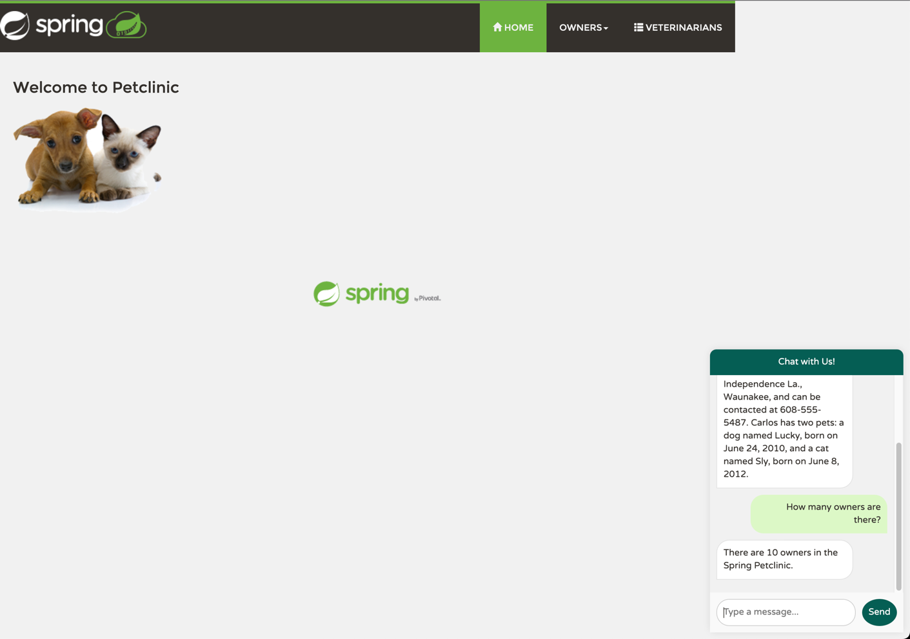

# Create AI-infused Java Apps with Azure OpenAI and Spring AI

In this chapter, we will explore how to create AI-infused Java applications using Azure OpenAI and Spring AI. We will start by configuring our Spring Boot application to connect with Azure OpenAI. Next, we'll implement a simple chatbot using Azure OpenAI's GPT-4o model to demonstrate seamless AI integration into Java applications. Additionally, we will cover function calling with Spring AI, allowing our application to perform complex tasks by leveraging AI models.

---

In this module, we'll focus on two key objectives:
1. :white_check_mark: Integrate Azure OpenAI with Chatbot.
2. :bar_chart: Use Function Calling to implement basic RAG with Spring AI.

## Azure OpenAI Integration with Chatbot

We will first integrate Azure OpenAI with our Spring Boot application to create a chatbot. Bicep that we run with `azd up` in our very first lab creates the Azure OpenAI deployment named as `gpt-4o`. We will use this deployment to provide the chat experience to PetClinic application.

Go to `spring-petclinic-chats-service` and open the `application.yml` file. Replace the ${AZURE_OPENAI_API_KEY} and ${AZURE_OPENAI_ENDPOINT} with your Azure OpenAI API key and endpoint.

```yaml
spring:
  application:
    name: chats-service
  config:
    import: optional:configserver:${CONFIG_SERVER_URL:http://localhost:8888/}
  ai:
    azure:
      openai:
        api-key: ${AZURE_OPENAI_API_KEY}
        endpoint: ${AZURE_OPENAI_ENDPOINT}
        chat:
          options:
            model: gpt-4o
            deployment-name: gpt-4o
            temperature: 0.5

```

### Prompt Engineering with GitHub Copilot

What empowering GitHub Copilot under the hood is specially trained LLM model that can generate code snippets based on the context. As Spring AI is very new project and latest knowledge cutoff date for Copilot is Oct 2023, it may not have the knowledge about Spring AI. To overcome this limitation, we can use the prompt engineering to provide the context to Copilot. For that, there is a markdown file `CONTEXT.md` which describes the basic usage of Spring AI with Azure Open AI. All you need to do is to supply this as part of your prompt. 

For VSCode, you can add the file manually:


For JetBrains IntelliJ IDEA, you need to first open the file as a tab then add it:


Now, you need to prompt GitHub Copilot to integrate with Azure OpenAI endpoint. Here is the sample prompt that you can use:

```text
1. Create an POST endpoint at '/chat' that provides the chat completion
2. Use AzureOpenAiChatModel to do the chat completion with Azure OpenAI Endpoint
3. Use User Prompt and System Prompt
```

> :information_source: Make sure you add the proper files(`CONTEXT.md` and `ChatController.java`) before prompting GitHub Copilot.


We will slightly change the system prompt to make it more specific to our application, PetClinic. Here is the updated prompt:

```text
You are a friendly AI assistant designed to help with the management of a veterinarian pet clinic called Spring Petclinic.
Your job is to answer questions about and to perform actions on the user's behalf, mainly around
veterinarians, owners, owners' pets and owners' visits.
You are required to answer an a professional manner. If you don't know the answer, politely tell the user
you don't know the answer, then ask the user a followup question to try and clarify the question they are asking.
If you do know the answer, provide the answer but do not provide any additional followup questions.
When dealing with vets, if the user is unsure about the returned results, explain that there may be additional data that was not returned.
Only if the user is asking about the total number of all vets, answer that there are a lot and ask for some additional criteria.
For owners, pets or visits - provide the correct data.
```

Full source code would look like below:

<details markdown="block">

### Completed Source Code

```java
package org.springframework.samples.petclinic.chats;

import org.springframework.ai.azure.openai.AzureOpenAiChatModel;
import org.springframework.ai.chat.messages.Message;
import org.springframework.ai.chat.messages.UserMessage;
import org.springframework.ai.chat.model.ChatResponse;
import org.springframework.ai.chat.prompt.Prompt;
import org.springframework.ai.chat.prompt.SystemPromptTemplate;
import org.springframework.beans.factory.annotation.Autowired;
import org.springframework.web.bind.annotation.PostMapping;
import org.springframework.web.bind.annotation.RequestBody;
import org.springframework.web.bind.annotation.RestController;

import java.util.List;

@RestController
public class ChatController {

    private final AzureOpenAiChatModel chatClient;

    @Autowired
    public ChatController(AzureOpenAiChatModel chatClient) {
        this.chatClient = chatClient;
    }

    @PostMapping("/chatclient")
    public String chat(@RequestBody String userPrompt) {
        Message systemMessage = new SystemPromptTemplate("""
         You are a friendly AI assistant designed to help with the management of a veterinarian pet clinic called Spring Petclinic.
         Your job is to answer questions about and to perform actions on the user's behalf, mainly around veterinarians, owners, owners' pets and owners' visits.
         You are required to answer an a professional manner. If you don't know the answer, politely tell the user you don't know the answer, then ask the user a followup question to try and clarify the question they are asking.
         If you do know the answer, provide the answer but do not provide any additional followup questions.
         When dealing with vets, if the user is unsure about the returned results, explain that there may be additional data that was not returned.
         Only if the user is asking about the total number of all vets, answer that there are a lot and ask for some additional criteria.
         For owners, pets or visits - provide the correct data.
        """).createMessage();

        UserMessage userMessage = new UserMessage(userPrompt);

        Prompt prompt = new Prompt(List.of(systemMessage, userMessage));
        ChatResponse response = chatClient.call(prompt);

        return response.getResult().getOutput().getContent();
    }
}
```
</details>

### Test the Chatbot

```bash
cd ~/spring-petclinic-chats-service
mvn clean package
az containerapp up \
  --name chats-service \
  --environment ${ACA_ENVIRONMENT_NAME} \
  --artifact target/chats-service-3.2.11.jar \
  --ingress external \
  --target-port 8080 \
  --query properties.configuration.ingress.fqdn
```

Once chats-service is running, you should be able to test the chatbot from the chat box on the application.


## Function Calling with SpringAI

In this section, we will implement a basic RAG (Retrieval-Augmented Generation) pattern using Spring AI. The Retrieval-Augmented Generation (RAG) pattern is an industry standard approach to building applications that use large language models to reason over specific or proprietary data that is not already known to the large language model. This is critical because Azure Open AI model that we integrated in the previous step don't know anything about the PetClinic application.

There are multiple ways to implement RAG, but we will use the simplest one. We will use the Spring AI's `FunctionCalling` class to call the Azure OpenAI model. The `FunctionCalling` class is a utility class that allows you to call a function with a given input and output. We will use this class to call the Azure OpenAI model with a given input and output.

### Writing List Owners Function

We will implement a function that lists all the owners in the PetClinic application. This function will be called by the Azure OpenAI model to retrieve the list of owners. 

Full source code here:

```java
package org.springframework.samples.petclinic.chats;

import org.springframework.ai.azure.openai.AzureOpenAiChatModel;
import org.springframework.ai.azure.openai.AzureOpenAiChatOptions;
import org.springframework.ai.chat.messages.Message;
import org.springframework.ai.chat.messages.UserMessage;
import org.springframework.ai.chat.model.ChatResponse;
import org.springframework.ai.chat.prompt.Prompt;
import org.springframework.ai.chat.prompt.SystemPromptTemplate;
import org.springframework.ai.model.function.FunctionCallback;
import org.springframework.beans.factory.annotation.Autowired;
import org.springframework.context.annotation.Bean;
import org.springframework.context.annotation.Configuration;
import org.springframework.core.ParameterizedTypeReference;
import org.springframework.http.HttpMethod;
import org.springframework.http.ResponseEntity;
import org.springframework.web.bind.annotation.PostMapping;
import org.springframework.web.bind.annotation.RequestBody;
import org.springframework.web.bind.annotation.RestController;
import org.springframework.web.client.RestTemplate;

import java.util.Arrays;
import java.util.List;
import java.util.function.Function;

@RestController
public class ChatController {

    private final AzureOpenAiChatModel chatClient;

    
    @Autowired
    public ChatController(AzureOpenAiChatModel chatClient) {
        this.chatClient = chatClient;
    }

    @PostMapping("/chatclient")
    public String chat(@RequestBody String userPrompt) {
        Message systemMessage = new SystemPromptTemplate("""
                                                                  You are a friendly AI assistant designed to help with the management of a veterinarian pet clinic called Spring Petclinic.
                                                                  Your job is to answer questions about and to perform actions on the user's behalf, mainly around veterinarians, owners, owners' pets and owners' visits.
                                                                  You are required to answer an a professional manner. If you don't know the answer, politely tell the user you don't know the answer, then ask the user a followup question to try and clarify the question they are asking.
                                                                  If you do know the answer, provide the answer but do not provide any additional followup questions.
                                                                  When dealing with vets, if the user is unsure about the returned results, explain that there may be additional data that was not returned.
                                                                  Only if the user is asking about the total number of all vets, answer that there are a lot and ask for some additional criteria.
                                                                  For owners, pets or visits - provide the correct data.
                                                                 """).createMessage();

        UserMessage userMessage = new UserMessage(userPrompt);

        Prompt prompt = new Prompt(List.of(systemMessage, userMessage), AzureOpenAiChatOptions.builder()
                                                                                              .withFunction("OwnerService")
                                                                                              .build());
        ChatResponse response = chatClient.call(prompt);

        return response.getResult().getOutput().getContent();
    }

    @Configuration
    static class Config {

        @Bean
        public FunctionCallback ownersFunctionInfo() {

            return FunctionCallback.builder()
                                   .description("List of all the owners")
                                   .function("OwnerService", new OwnerService())
                                   .inputType(Void.class)
                                   .build();
        }

    }
}

class OwnerService implements Function<Void, List<OwnerDetails>> {

    @Override
    public List<OwnerDetails> apply(Void unused) {
        RestTemplate restTemplate = new RestTemplate();
        ResponseEntity<List<OwnerDetails>> responseEntity = restTemplate.exchange(
                "http://frontend-service/api/customer/owners",
                HttpMethod.GET,
                null,
                new ParameterizedTypeReference<List<OwnerDetails>>() {
                }
        );

        List<OwnerDetails> owners = responseEntity.getBody();
        return owners;
    }
}
```

Try with different questions regarding owners. 



---


## :notebook_with_decorative_cover: Summary

In this module, we have successfully integrated Azure OpenAI with our Spring Boot application to create a chatbot. We have also implemented a basic RAG pattern using Spring AI to retrieve the list of owners in the PetClinic application. By leveraging Azure OpenAI and Spring AI, we have demonstrated how to create AI-infused Java applications that can intelligently interact with users and perform complex tasks.

