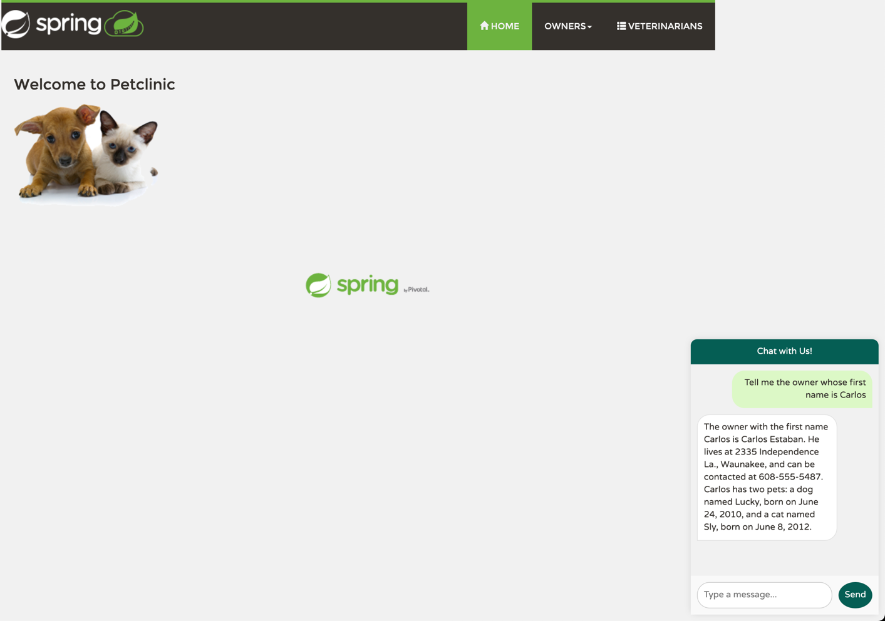

# Java on Azure Container Apps with Azure OpenAI

This workshop is intended to provide a hands-on experience on running Java on Azure Container Apps. We will use GitHub Copilot to generate code snippets and deploy those Java applications to Azure Container Apps. This workshop is a Bring-Your-Own-Laptop session, so bring your Windows, OSX, or Linux laptop. If you have an access to GitHub Codespaces, you can use it as well.

# What you are going to do in this workshop

- Create `hello-world` Spring Boot application and deploy it to Azure Container Apps
- Use KEDA(Kubernetes-based Event Driven Autoscaler) to autoscale the application
- Create a managed Java component like Config Server, Eureka Server, and Spring Boot Admin
- Deploy PetClinic microservices and bind those with managed Java components
- Use Azure Service Connector to connect to Azure services, additionally we will explore passwordless connection with Service Connector
- Monitor Java applications on Azure Container Apps
- Create AI-infused Java applications with Azure OpenAI and Spring AI

# Spring PetClinic Microservices

### Simple RAG with Spring AI Function Calling with Azure OpenAI

---

# Agenda

1. [Prepare Your Azure Environment](01-workshop-environment-setup/README.md)
2. [Create a Hello World Spring Boot App and Deploy to Azure Container Apps](02-deploy-helloworld/README.md)
3. [Autoscaling with KEDA(Kubernetes-based Event Driven Autoscaler)](03-use-keda-autoscaling/README.md)
4. [Create Managed Java Component on Azure Container Apps](04-create-managed-java-component/README.md)
5. [Deploy PetClinic Microservices ](05-deploy-microservices/README.md)
6. [Use Azure Service Connector](06-use-service-connector/README.md)
7. [Monitoring Java Applications on Azure Container Apps](07-monitoring-java-aca/README.md)
8. [Create AI-infused Java Apps with Azure OpenAI and Spring AI](08-AI-with-java/README.md)

